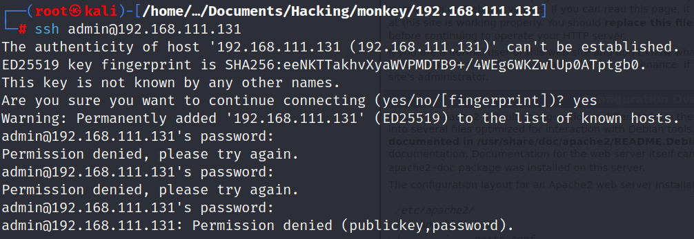

  

# 
 Informe de análisis de vulnerabilidades, explotación y resultados del reto Monkey

  

### 
 Generado por 

## 
 David Ossa Saldarriaga 
   

  

### 
 Fecha 

## 
 22/04/2024 
  

  

### 
 Academia Hacker Mentor 

  
  
  
  
  
  

---
---
---

# Tarea 3 - Reto Eternal

## Tabla de contenidos
[Fases del pentesting](#fases-del-pentesting)
1. [Reconocimiento](#1-reconocimiento)
2. [Escaneo y enumeración](#2-escaneo-y-enumeración)
3. [Explotación](#3-explotación)
    1. [Explotación automática](#explotación-automática)
        1. [Bandera 1](#bandera1-0ef3b7d488b11e3e800f547a0765da8e)
        2. [Bandera 2](#bandera2-a63c1c39c0c7fd570053343451667939)
    2. [Explotación manual](#explotación-manual)
4. [Mantener persistencia](#4-mantener-persistencia)

  
  
  
  
  
  
  
  
  
  
  
  
  
  
  
  

## Fases del pentesting.
### 1. Reconocimiento:
Procedemos a iniciar este pentesting realizando un reconocimiento de la máquina objetivo. Utilizamos un escaneo de la red para verificar la IP de la máquina.

    # arp-scan -l

Con este resultado y descartando las IPs que ya conocemos, podemos determinar que la IP de la máquina objetivo es *192.168.111.131* y vamos a enfocarnos en esta dirección para empezar los escaneos.

Para esta fase de reconocimiento podemos iniciar realizando un ping, podemos determinar si la máquina nos responde y sacar algunas hipótesis iniciales.

    # ping -c 5 192.168.111.131

Podemos observar que el ttl que resulta al hacer ping es igual a 64, lo cual nos podría indicar que el sistema operativo de la máquina objetivo es alguno basado en Linux, más adelante en próximas fases podremos confirmar si es o no este sistema operativo.

### 2. Escaneo y enumeración
Ya que sabemos la IP objetivo, procedemos ahora a realizar un escaneo más profundo con el comando *nmap* con el fin de determinar qué puertos abiertos tiene la máquina y qué servicios se están ejecutando en ellos.

    # nmap -sV -p- -T5 -sS 192.168.111.131

Ahora con un poco más de detalle podemos confirmar que efectivamente estamos atacando una máquina con sistema operativo basado en Linux. Adicional a esto podemos ver que tenemos 3 puertos abiertos, corriendo servicios de ftp, ssh y http.

Con esta informacón tenemos varias cosas básicas que podemos revisar de nuestra página objetiva, la primera de ellas es que vemos que la máquina corre un servicio http en el puerto 80, por lo tanto podemos empezar verificando la página web.

Vemos que la página web en su ruta por defecto no nos da mucha información sobre la página como tal ya que lo que vemos en la página por defecto del servidor Apache, sin embargo, nos da información sobre el sistema operativo específico de la máquina, ya sabíamos que es un SO basado en Linux, pero ahora confirmamos que estamos hablando de una máquina **Debian**.

Procedemos ahora a analizar si podemos conectarnos a alguno de los otros dos servicios usando credenciales básicas o conocidas como default. 

Iniciamos con *ssh* en el puerto 22.

    # ssh [username]@192.168.111.131

Realizamos la prueba inicial con los usuarios admin y root usando las contraseñas "admin", "administrador" y "administrator" pero no podemos ganar acceso la máquina.

Ahora tratemos de ganar acceso por medio de ftp para ver si podemos ver algun archivo y/o folder que nos de información sobre la máquina.

    # ftp 192.168.111.131

Intentamos con usuarios y contraseñas conocidos (default) que si el servicio no está bien configurado podemos tener acceso. Siendo este el caso podemos ver que el servicio ftp permite una conexión con un usuario anónimo "anonymous" sin contraseña.

Veamos ahora qué información podemos obtener de acá.

Al momento de listar los archivos podemos ver que tenemos acceso a un archivo llamado *notas.txt* y procedemos a leerlo. Dentro de este archivo podemos observar que hay algunos datos importantes que pueden sernos útiles eventualmente para acceder al sistema, ya que parecen ser nombres de usuarios y/o contraseñas.

Teniendo esta información puede ser buena idea empezar a crear diccionarios con todos estos datos para tratar de acceder a los servicios.

Pero, antes de esto tratamos de descargar el archivo a nuestra máquina para tenerlo de forma local y poder trabajarlo más fácilmente.

    ftp> get notas.txt

Ahora sí procedemos a crear los posibles usuarios que extraeremos del archivo notas.

Ahora bien, de esta información una de las más potentes que podemos usar es la contraseña que tenemos en forma de hash, podemos hacer uso de alguna herramienta para tratar de descifrar este hash.

Usando la herramienta "*John the ripper*" podemos intentar encontrar la contraseña usando el hash.

    # john hashes

Los recursos en la máquina virtual son un poco limitados y vemos que después de casi 20 minutos no ha podido completar el descrifrado del hash, por lo cual tratamos de recurrir a otra herramienta para descifrar el hash, en este caso, una herramienta web ([hashes.com](hashes.com))

Podemos ahora añadir esta nueva contraseña a nuestro diccionario de contraseñas.

    # echo "junior01" >> passwords

Ya hemos sacado algo de información por medio de *ftp*, tenemos una serie de usuarios y contraseñas que podemos usar para intentar conectarnos por el servicio *ssh*. Haciendo uso de la herramienta **crackmapexec ssh** podemos intentar realizar una conexión usando las listas de usuarios y contraseñas que tenemos en el diccionario.

    # crackmapexec ssh 192.168.111.131 -u users -p passwords

No podemos acceder por medio de *ssh* al sistema con estos diccionarios, por lo cual podemos asumir que los datos del usuario no son del sistema sino un usuario de la aplicación o página web y esto nos puede ser útil para más adelante.

Continuamos ahora en esta fase de escaneo y enumaración con el puerto 80 y el servicio *http*. Sabemos que existe una página web en la máquina objetivo y ya pudimos acceder por medio del navegador, ahora podemos proceder a realizar la técnica de **fuzzing** para encontrar posibles rutas que sean de utilidad.

Haciendo uso de **gobuster** iniciamos el escaneo de todas las posibles rutas que existen en la página web

Encontramos 3 rutas diferentes de las cuales 1 responde con código 403 el cual hace referencia a un servicio que muestra únicamente estando autenticado y por lo tanto está "*forbidden*". De los otras dos rutas que responden con código 200 podemos acceder para verificar con qué nos encontramos.

Vemos un portal de php my admin para loguearnos y poder administrar información de la base de datos.

Tenemos una herramienta que nos permite tratar de hacer una autenticación en este servicio por medio de fuerza bruta.

No tenemos acceso así que procedemos a analizar la próxima ruta. 

Tenemos nuevamente un portal para iniciar sesión. Para poder tratar de ingresar a este portal con los diccionarios que tenemos podemos usar **burpsuite** para interceptar el tráfico antes de enviar la conexión y modificar la información que se envía al servidor para la conexión.

Iniciamos el proxy en el navegador para poder enviar todas comunicaciones hacia burpsuite.

Y comenzamos a interceptar burpsuite como tal, para recibir la información. Iniciamos una conexión para autenticarnos con usuario y contraseña por defecto "admin | admin"

Podemos notar que el usuario y la contraseña se ven de esta forma en la petición que se envía al servidor para poder autenticarse. 

Ahora para poder automatizar la autenticación y usar los diccionarios de usuarios y contraseñas que tenemos enviamos la conexión a la opción intruder deñ burpsuite y convertimos el usuario y contraseña en variables. 

Para este caso vamos a usar un tipo de ataque "*cluster bomb*" usando los usuarios y contraseñas que creamos en los diccionarios.

Lanzamos el ataque 

En estos resultados podemos ver que todos terminaron en una redirección por tener código de status *302*, sin embargo hay uno que difiere del resto en el tamaño de respuesta y esto nos puede dar un indicio de que la redirección es una página diferente al resto.

Procedemos ahora a realizar la autenticación manual con estos datos para ver qué sucede.

Tenemos ahora acceso al sistema de estudiantes y procedemos ahora a realizar la explotación como tal.

### 3. Explotación

Para iniciar la explotación podemos buscar las diferentes vulnerabilidades que hayan en los servicios que ya sabemos que están corriendo en la máquina objetivo

    # searchsploit vsftpd 3.0.3

    # searchsploit OpenSSH 7.

    # searchsploit Apache 2.4.38

Como podemos ver, no hay ningún exploit acá que nos pueda servir específicamente para las versiones de los servicios que estamos atacando. Procedemos entonces a buscar la forma de explotar con el acceso que ya tenemos.

En la opción "*Mi perfil*" del portal al cual ingresamos vemos que podemos modificar cierta información, entre ellas la imagen y que podemos cargar un archivo acá.

Cargamos en el formulario una imagen de prueba para ver qué sucede al momento de subirla

Vemos que la foto se carga y se actualiza correctamente. Si ahora analizamos la foto en una pestaña aparte podemos ver que tiene un path específico dentro del servidor *"monkey/studentphoto/test.png"*. Si ahora retrocedemos en esta ruta deberíamos poder ver qué más información puede haber en el folder que contiene la foto *test*.

Tenemos una pista bastante fuerte en este momento, tenemos un archivo php y si verificamos con **wappalyzer**, confirmamos que el lenguaje de programación para esta página web es php, lo cual nos podría dar una ventaja ya que php es un lenguaje que se interpreta/ejecuta, a diferencia de html que se muestra. Por lo tanto procederemos a verificar si podemos cargar directamente un archivo *.php* al sitio.

Ahora bien, con este punto de entrada, podemos intentar cargar código en un archivo php para crear una reverse shell hacia nuestra máquina.

Cargamos el archivo "*revshell.php*" con el código necesario para generar una reverse shell hacia nuestra máquina Kali y antes de ejecutarlo procedemos a escuchar en el puerto 6464 con netcat que es el puerto para el cual apuntamos la reverse shell.

    # nc -lvnp 6464

Tenemos acceso con el usuario *www-data* el cual es un usuario con el que no tenemos muchos permisos y que debemos elevar permisos de alguna forma para poder ganar más accesos.

Buscamos con este usuario alguna de las banderas dentro del folder de */home* en el cual deben estar los usuarios.

    # find /home

##### Bandera1: 47ee0702e489445bae251df46bc88b73

Buscamos escalar privilegios y podemos buscar dentro de los recursos de la página web ya que es muy probable que exista el código para la conexión con la base de datos.

Dentro del folder */var/www/html/monkey/* podemos observar que hay un directorio *includes* el cual suele tener información de configuración importante.

Revisamos el código de *config.php* 

Con este usuario y contraseña podemos ahora tratar de ingresar nuevamente al portal de phpmyadmin que es el que maneja la base de datos.

Ahora bien, notamos que el usuario con el cual entramos a la base de datos es "hackermentor" y este nombre de usuario también lo vimos en el directorio /home de la máquina. Y si recordamos el archivo *notas.txt* que obtuvimos al principio nos decía "Le dije que no utilice la mismo contraseña en otros servicios y que la cambie lo más pronto posible". Lo cual nos indica que puede ser que hayan otros servicios con este mismo usuario y contraseña, por lo cual procedemos a intentar con el servicio de SSH.

    # ssh 192.168.111.131 -l 'hackermentor'

Ahora tenemos un usuario con más privilegios que el primero que teníamos y una conexión más estética y fácil de usar que la primer reverse shell. Sin embargo, los privilegios que tenemos en estos momentos aún no son los máximos y podemos buscar la forma de continuar escalando aún más. Para ello podemos hacer uso del script de linpeas el cual automatiza la búsqueda de opciones para escalar privilegios en una máquina linux.

Al ejecutar el script de linpeas podemos ver en el menú de cronjobs que existe uno que nos puede ayudar con la escalación de privilegios que necesitamos. Procedemos entonces a revisar el archivo que nos menciona el cronjob.

    # cat backup.sh

Este script lo que hace basicamente es hacer un backup de todo lo que hay en la carpeta includes que encontramos anteriormente y el único usuario con permisos sobre ese backup es el usuario root. 

De acuerdo a la información del linpeas sabemos que es un cronjob, ahora necesitamos saber cada cuándo se está ejecutando para poder hacer uso de este script.

Con una diferencia de 1 minuto podemos afirmar que el proceso de backup se está ejecutando cada minuto, es decir que podemos modificar el archivo backup.sh para que sea ejecutado por el usuario root cada minuto y nos de acceso.

Para el siguiente paso vamos a realizar la escalación de privilegios junto con la persistencia a la máquina. 

Creamos en nuestra máquina Kali una llave ssh para root.

Verificamos los archivos y montamos un servidor http para descargar los archivos.

Descargamos la llave pública en la máquina monkey.

Verificamos la llave y editamos el script de backup para que cree una carpeta .ssh dentro de los archivos de root y cargamos la llave pública en los authorized_keys para root.

Esperamos que se ejecute al menos una vez el script de backup y verificamos la conexión con ssh usando la llave privada que generamos anteriormente.

Ahora tenemos acceso como root y mantenemos la persistencia teniendo estas llaves ssh para conectarnos directamente cada vez que lo necesitemos.

Verificamos la segunda bandera

##### Bandera2: d844ce556f834568a3ffe8c219d73368

Reversamos los cambios que hicimos en el archivo *backup.sh* para que continue realizando el backup de forma normal y no levantar sospechas.

Después de hacer los cambios revisamos si podemos conectarnos nuevamente como root y no se borraron nuestros cambios al revertir el script.

